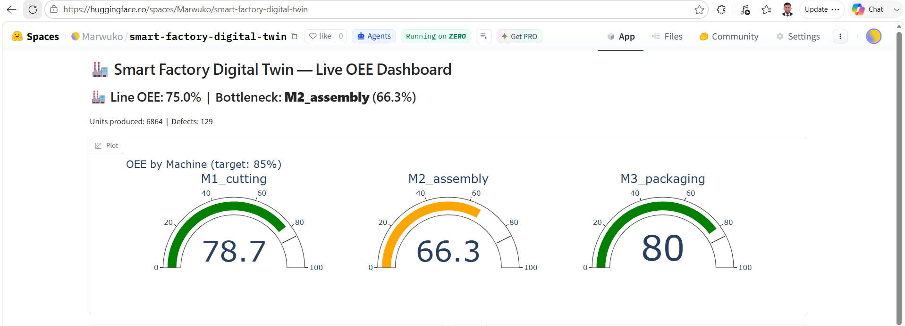

# Smart Factory Digital Twin

A simulated production line with real-time OEE analytics. Three virtual machines produce units, break down, jam, and make defects. Every event is logged to a database, and a live dashboard computes the metrics a plant manager actually uses to run a factory.

**Live dashboard:** https://huggingface.co/spaces/Marwuko/smart-factory-digital-twin



## Why this project

Factories lose money in three ways: machines that are down, machines that run slower than they should, and machines that produce scrap. OEE (Overall Equipment Effectiveness) captures all three in one number:

```
OEE = Availability x Performance x Quality
```

World-class factories run at 85%. Most run around 60%. The point of a digital twin is to see, at a glance, which machine is the bottleneck and which of the three losses is causing it. That tells you where to spend maintenance money.

This project builds that entire loop: a simulator that generates realistic production events, an analytics engine that computes OEE from the raw event log, and a live dashboard on top.

## Components

| File | Purpose |
|---|---|
| `simulator.py` | Simulates an 8 hour shift for 3 machines (cutting, assembly, packaging). Each machine has its own cycle time, breakdown probability, micro-stop probability, and defect rate. Events are written to SQLite. |
| `analytics.py` | Computes OEE per machine from the event log, plus a downtime Pareto showing which loss type costs the most minutes. |
| `app.py` | Gradio dashboard: OEE gauges per machine, factor breakdown (availability, performance, quality), and downtime by cause. Deployed on Hugging Face Spaces. |
| `factory_simulation.ipynb` | Development notebook. |

## How the simulation works

The simulator is an event generator, not a state machine. Each machine advances through the shift tick by tick. On every cycle it can:

- produce a good unit (most of the time)
- produce a defective unit (1 to 4% depending on the machine)
- hit a micro-stop, a short jam of 20 to 90 seconds
- break down, which costs 10 to 40 minutes of repair time

Everything is written to a single `production_events` table with a timestamp, so the analytics layer works the same way it would against a real MES system: OEE is computed from raw events, not assumed.

The machines are deliberately not identical. M2_assembly has the highest breakdown and defect rates, which gives the analytics a real bottleneck to find.

## Sample results (one simulated shift)

| Machine | Availability | Performance | Quality | OEE |
|---|---|---|---|---|
| M1_cutting | 0.904 | 0.888 | 0.981 | 78.7% |
| M2_assembly | 0.774 | 0.890 | 0.962 | 66.3% |
| M3_packaging | 0.907 | 0.888 | 0.992 | 80.0% |

Reading the table: M2 is the bottleneck, and the availability column shows why. It lost the most time to breakdowns (about 85 minutes in this shift). The highest-value intervention here is preventive maintenance on M2, not making anything run faster. That is the kind of decision OEE decomposition exists to support.

Because breakdowns are random and rare, results vary between runs. Some shifts M2 barely breaks down and the Pareto looks completely different. One shift is a small sample, which is itself a useful lesson in reading production data.

## Run it yourself

```bash
git clone https://github.com/Marwuko/smart-factory-digital-twin.git
cd smart-factory-digital-twin
pip install pandas plotly gradio

python simulator.py    # generates factory.db (one 8h shift, 3 machines)
python analytics.py    # prints OEE table and downtime Pareto
python app.py          # launches the dashboard locally
```

Every run of `simulator.py` appends a fresh shift, so you can build up multi-shift history and watch the numbers move.

## Roadmap

- [ ] Multi-shift history with OEE trend over time
- [ ] Configurable line layout (machines and parameters from a YAML file)
- [ ] Buffer simulation between machines, so a breakdown upstream starves the line downstream
- [ ] Integration with my [AI visual inspection system](https://github.com/Marwuko/ai-visual-inspection): use real defect detections as the Quality input of OEE

## Related project

This is the second piece of a two-part smart factory portfolio. The first is an [AI visual inspection system](https://github.com/Marwuko/ai-visual-inspection) that detects surface defects with YOLOv8 and logs results to SQL. Quality inspection covers one third of OEE. This project covers the rest of the line.
